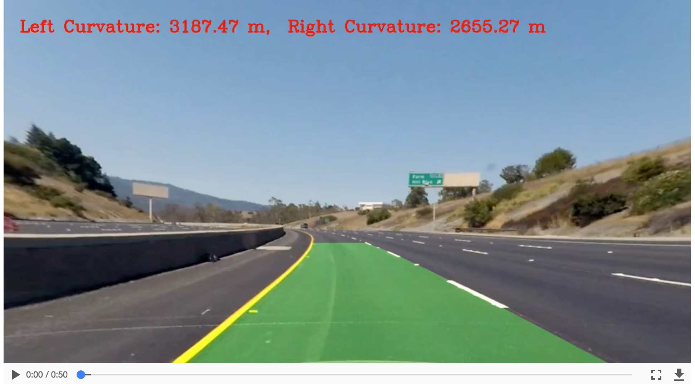

## Advanced Lane Finding

Lane finding is crucial for developing algorithms for self-driving cars.

The lane-finding algorithm should be robust to changing lighting conditions, weather conditions, other cars/vehicles on the road, curvature of road and type of road itself.

In this project, I will use the computer vision techniques and tools to identify lane lines on the road in an advance way. I will develop pipelines on a series of individual images, and later apply the result to a video stream.

The goals / steps of this project are the following:
---
* Compute the camera calibration matrix and distortion coefficients given a set of chessboard images.
* Apply a distortion correction to raw images.
* Use color transforms, gradients, etc., to create a thresholded binary image.
* Apply a perspective transform to rectify binary image ("birds-eye view").
* Detect lane pixels and fit to find the lane boundary.
* Determine the curvature of the lane and vehicle position with respect to center.
* Warp the detected lane boundaries back onto the original image.
* Output visual display of the lane boundaries and numerical estimation of lane curvature and vehicle position.

## Dependencies
This project requires Python 3.5 and the following Python libraries installed:
* numpy
* opencv
* moviepy
* pickle

Implementation details
---
### 1. Undistort camera image and apply perspective transform to get a bird-eye view of the the road.

The easiest way to do this is to investigate an image where the lane lines are straight, and find four points lying along the lines that, after perspective transform, make the lines look straight and vertical from a bird's eye view perspective(top down view).

### 2. Convert to HSV color space and apply color mask to identify yellow lines

Using HSV color space instead of RGB is easier for us to identify yellow and white lanes in different lighting conditions in the images.

### 3. Apply Sobel filters to get image with potential line/edges

The Sobel operator is at the heart of the Canny edge detection algorithm.  Here we use the Sobel operator to an image is a way of taking the derivative of the image in the x or y direction. 

### 4. Combine binary masks from Sobel filters and HSV color masks

Combining serveal masks from different sources (color, Sobel, thresholding) with different weight togather allow us to extract more useful lane image information while filtering out unrelavent parts.

### 5. Apply polynomial regression to compute the left and right lanes (identify the peak of historgram horizontally from button up)
Fit a second order polynomial to get the curving lane approximation.
$$f(y) = Ay^2 +By +C$$

### 6. Calculate curvature and lane fitting, and plot them back to the original camera image
The equation for radius of curvature is based on the best fitted second order polynomial model.
$$R_{curve} = \frac{(1+(2Ay+B^2)^{3/2})}{|2A|}$$

### 7. Build pipeline to process the live stream of road videos from the front camera of the car to identify and analyze lane in real time 

## Reflection 
1. Thresholds are hard coded arbitrariy, which can be improved by assigning dynamic values by learning the image/video via machine learning algorithms
2. The pipeline does not work well for more complicated images with varying weather/road/lighting conditions.  Adding smoothing and image propocessing steps may be helpful.
3. More real-time information may be added for analysis/dignosis purpose.

Reference
---
- http://docs.opencv.org/2.4/modules/calib3d/doc/camera_calibration_and_3d_reconstruction.html
- https://medium.com/@vivek.yadav/robust-lane-finding-using-advanced-computer-vision-techniques-mid-project-update-540387e95ed3#.xczay6o2c
- https://github.com/kunfengchen/carnd-p4
- https://github.com/Dalaska/CarND-P4-Advance-Lane-Lines

